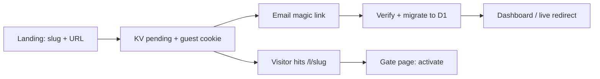

# Openly design system

Product and visual direction for Openly, aligned with the editorial minimalism of [Microsoft Surface RTX Spark Dev Box](https://www.microsoft.com/en-us/surface/devices/surface-rtx-spark-dev-box).

## North star

**Create a link first. Sign in to go live.**

The homepage is the product — not a login wall. Users reserve a slug and destination immediately; data sits in KV until magic-link signup promotes links into D1.

## Reference: Surface RTX Spark page

Use this page as the mood board, not a pixel-perfect clone.

| Pattern | Surface reference | Openly application |
|--------|-------------------|-------------------|
| Hero typography | Large display headline (`Built for more.`) with tight tracking | `Built for sharing faster.` — clamp-based `hero-display`, `-0.04em` letter-spacing |
| Layout | Full-bleed light canvas, product/form as focal object | Split hero + stage card on desktop; stacked on mobile |
| Color | Near-black copy on cool gray-white, accent used sparingly | `--ink: #0b0b0c`, `--paper: #f4f4f6`, accent `#2563eb` for emphasis words only |
| Surfaces | Soft cards, subtle shadow, generous radius | 20px panel radius, `0 24px 48px` shadow on create/activate card |
| Sections | Numbered story blocks (`Code on day one.`, feature grid) | Three-column `feature-grid` under the fold |
| CTA | High-contrast primary (black button) | `btn-primary` uses `--ink` fill, not blue — blue reserved for links/highlights |
| Photography | Product on neutral background | Logo mark + typographic hero (no stock photos in v1) |
| Footer | Light legal/offer line | Single line: plan limits |

## User flow



1. **Reserve** — `POST /api/pending` writes `slug:{slug}` and `guest:{id}` in KV (7-day TTL).
2. **Activate** — Magic link stores `magic:{tokenHash} → guestId`. On verify, pending rows migrate into `slugs` + `link_accounts`.
3. **Redirect** — `/l/:slug` serves 302 only when the slug exists in D1. Pending slugs show `renderPendingGate`.

## Pages

| Route | Audience | Purpose |
|-------|----------|---------|
| `/` | Guest | Landing + create + post-reserve activation |
| `/` | Signed in | Dashboard (analytics) |
| `/signin` | Guest | Secondary sign-in |
| `/l/:slug` | Public | Live redirect or pending gate |
| `/auth/*` | Guest | Magic link |

## Typography

- **UI**: `Segoe UI`, system sans stack (matches Microsoft marketing pages on Windows).
- **Display**: Weight 650, size `clamp(2.75rem, 8vw, 4.75rem)` on landing hero.
- **Body**: 16px / 1.55 on landing; 15px on dashboard.
- **Labels**: 13px, medium weight, `--ink-soft`.

## Spacing & grid

- Max content width: **1120px** (landing), **1080px** (dashboard).
- Section rhythm: 24px / 40px / 56px vertical steps.
- Form gaps: 14–16px between fields.

## Components

### Landing create panel

- White card, 28px padding, primary form.
- Live slug check (public `GET /api/check`).
- Submit label: **Reserve link** (disabled until slug validates).

### Activation panel

- Shown after reserve (`/?created=slug`) and on pending gate.
- Link preview block (mono URL, destination muted).
- Email field → `POST /auth/magic-link`.

### Dashboard

- Unchanged information architecture; welcome flash after first sign-in.
- Stat cards, usage meter, analytics blocks.

## Tokens (landing)

```css
--ink: #0b0b0c;
--paper: #f4f4f6;
--accent: #2563eb;
--hero-display: clamp(2.75rem, 8vw, 4.75rem);
```

Dashboard retains its own token set in `dashboard.ts` for density; converge in a later pass if needed.

## Infrastructure

- **KV binding**: `PENDING` — guest sessions, reserved slugs, magic-link guest association.
- **D1**: authoritative slugs, accounts, clicks after activation.
- **Limit**: Up to 5 pending links per guest (matches free tier).

## Copy tone

- Short, confident sentences (Surface-style).
- Avoid jargon; say **reserve**, **activate**, **go live**.
- Example eyebrow: `Private links. Simple analytics.`

## Future polish (optional)

- Scroll-driven hero scale (Surface marketing motion).
- Product render or abstract grid texture in hero background.
- Dark mode variant with inverted hero card.
- Unify dashboard tokens with landing for one design language.